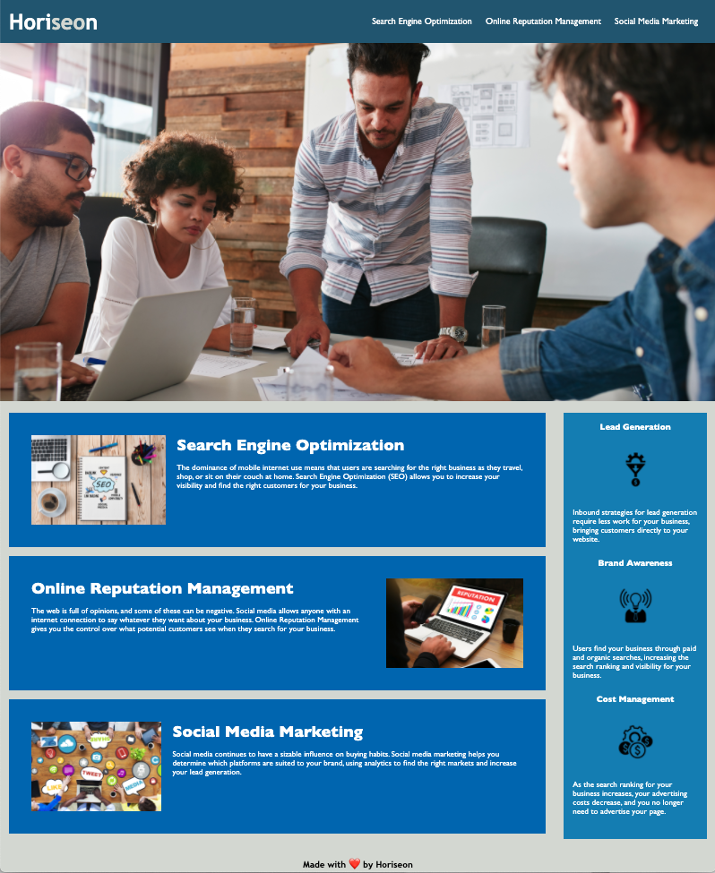

# First Project

Welcome to the README for my first project as a student of Coding Boot Camp at UCLA Extension.

## Description

My first project is centered around refactoring code for a client in order to maximize accessibility and clean up the HTML and CSS given in the starter code. In this scenario, the client is Horiseon, a digital marketing group. I made sure all links function, alt attributes were added to all pictures, a descriptive title was created and cleaned up all duplicates in CSS. 

## Link

[First Project](https://seanc0ne.github.io/first-project/)

## Screenshot

